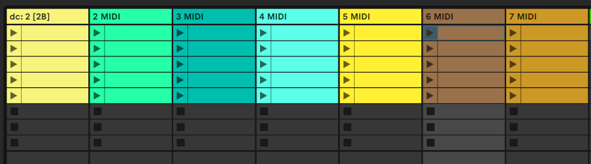

<!-- PROJECT SHIELDS -->
[![Contributors][contributors-shield]][contributors-url]
[![Forks][forks-shield]][forks-url]
[![Stargazers][stars-shield]][stars-url]
[![Issues][issues-shield]][issues-url]
[![BSD-2-Clause License][license-shield]][license-url]

<!-- PROJECT LOGO -->
 

  

  <h3 align="center">DAL Connector - Deluge Ableton Live Connector</h3>

  

    A control surface script for connecting a Synthstrom Deluge to Ableton Live 11
     
     
    <a href="https://youtu.be/ZGC71gpfkwQ&vq=hd1080"><strong>View Demo</strong></a>
     
     
    <a href="https://github.com/baronrabban/dalconnector/issues">Report Bug</a>
    ·
    <a href="https://github.com/baronrabban/dalconnector/issues">Request Feature</a>
  

<!-- TABLE OF CONTENTS -->

  
Table of Contents

  <ol>
    <li>
      <a href="#getting-started">Getting Started</a>
      <ul>
        <li><a href="#requirements">Requirements</a></li>
        <li><a href="#installation">Installation</a></li>
      </ul>
    </li>
    <li><a href="#usage">Usage</a></li>
    <li><a href="#Troubleshooting">Troubleshooting</a></li>
    <li><a href="#FAQ">FAQ</a></li>
    <li><a href="#contributing">Contributing</a></li>
    <li><a href="#license">License</a></li>
    <li><a href="#contact">Contact</a></li>
    <li><a href="#acknowledgements">Acknowledgements</a></li>
  </ol>

<!-- GETTING STARTED -->
## Getting Started

Download the latest version of the reposority

### Requirements

* A Deluge
* Ableton 11 - Earlier versions not supported, see FAQ
* A Toshiba Flashair card - Other wifi sdcards could be supported in the future, see FAQ

### Installation

1. Ensure that you can connect to your flashair card in your browser.  You will need to know the address you're using to connect to it.  I.e., http://flashair/   or http://192.168.1.100

2. Download the latest release from [Releases](https://github.com/baronrabban/dalconnector/releases)

3. Put the DALConnector folder in your Ableton "MIDI Remote Scripts" directory.  Ableton provides guidance:  [How to install a control surface script](https://help.ableton.com/hc/en-us/articles/209072009-Installing-third-party-remote-scripts)

4. Edit the file config.py and update the WIFI_CARD_ADDRESS field with the address you figured out earlier in step 1

5. In Ableton, under Options -> Preferences -> Link/Tempo/Midi add a new control surface.  If DALConnector isn't in the list, something went wrong.

6. Edit the title of a midi track with a song you have saved on your Deluge, such as "dc:4a" if you want song 4a

<!-- Troubleshooting -->
### Troubleshooting

**Log.txt file**
Live has a log.txt file which DAL Connector writes to.  Near the bottom of the page [Finding the log.txt file](https://help.ableton.com/hc/en-us/articles/209071629-Where-to-find-Crash-Reports) is a description of where to find the log.txt file

**Flashair Card**
This is a great page for setting up a flashair card:  [Using a Toshiba Flashair SD card](https://mattshub.com/blogs/blog/flashair-sd-card)
I run my card in "Station" mode but whatever works for you to connect to the card

<!-- FAQ -->
## FAQ

**Q:** Why does it only work with Ableton 11?

 **A:** Ableton switched some backend code on 11 and I wrote it with that in mind.  It's likely the code could be backported to earlier versions if someone wants to try that.
##

**Q:** Is Downrush required?

 **A:** No.  I did not try it with Downrush.  Please let me know if it works
##

**Q:** Kioxia took over for Toshiba and stopped making flashair cards

 **A:** Yes, it's a shame.  I don't suggest paying an exorbitant price for one.  See next question.
##

**Q:** Can this work with anything besides a Toshiba flashair card?

 **A:** I don't have another card to test with but the requirements are pretty basic.  DAL Connector just needs to be able to make requests to the card.  If someone gets it working with another card, please let me know.
##

**Q:** It's working but sometimes feels slow or it times out

 **A:** The wifi sdcard needs a good wifi signal.  Try moving it closer to the router.
##

<!-- CONTRIBUTING -->
## Contributing

Contributions are what make the open source community such an amazing place to be learn, inspire, and create. Any contributions you make are **greatly appreciated**.

1. Fork the Project
2. Create your Feature Branch (`git checkout -b feature/AmazingFeature`)
3. Commit your Changes (`git commit -m 'Add some AmazingFeature'`)
4. Push to the Branch (`git push origin feature/AmazingFeature`)
5. Open a Pull Request

<!-- LICENSE -->
## License

Distributed under the The 2-Clause BSD License. See `LICENSE` for more information.

<!-- ACKNOWLEDGEMENTS -->
## Acknowledgements
* [Downrush](https://github.com/jamiefaye/downrush)  Credit to Downrush and Jamie Fenton for my understanding of notedata and decoding bpm

<!-- MARKDOWN LINKS & IMAGES -->
<!-- https://www.markdownguide.org/basic-syntax/#reference-style-links -->
[contributors-shield]: https://img.shields.io/github/contributors/baronrabban/dalconnector.svg?style=for-the-badge
[contributors-url]: https://github.com/baronrabban/dalconnector/graphs/contributors
[forks-shield]: https://img.shields.io/github/forks/baronrabban/dalconnector.svg?style=for-the-badge
[forks-url]: https://github.com/baronrabban/dalconnector/network/members
[stars-shield]: https://img.shields.io/github/stars/baronrabban/dalconnector.svg?style=for-the-badge
[stars-url]: https://github.com/baronrabban/dalconnector/stargazers
[issues-shield]: https://img.shields.io/github/issues/baronrabban/dalconnector.svg?style=for-the-badge
[issues-url]: https://github.com/baronrabban/dalconnector/issues
[license-shield]: https://img.shields.io/github/license/baronrabban/dalconnector.svg?style=for-the-badge
[license-url]: https://github.com/baronrabban/dalconnector/blob/master/LICENSE.txt

